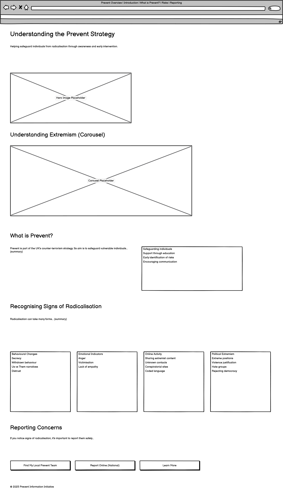

# Prevent Project

A responsive, simple, cyberpunk-themed information portal designed to educate users on the UK's "Prevent" counter-terrorism strategy. The site features educational resources, risk indicators, and a dynamic geolocation tool to help users find local safeguarding contacts.

[View the live website here](https://steff657.github.io/Prevent-Project/)

---

## Table Of Contents
1. [Design & Planning](#design--planning)
2. [Features](#features)
3. [Technologies Used](#technologies-used)
4. [Testing](#testing)
5. [Bugs](#bugs)
6. [Deployment](#deployment)
7. [Credits](#credits)

---

## Design & Planning

### User Stories

| User Role | Goal | Benefit |
|-----------|------|---------|
| **Visitor** | I want to clearly understand what the "Prevent" strategy is. | So that I can understand its role in community safety. |
| **Concerned Citizen** | I want to recognize the signs of radicalisation. | So that I can identify if someone I know needs help. |
| **Reporter** | I want to find the specific contact details for my local council. | So that I can report a concern to the correct authority quickly. |
| **Mobile User** | I want to access the site on my phone. | So that I can look up information while away from a computer. |
| **Visually Impaired User** | I want the site to use high-contrast colours. | To ensure the text is legible and accessible. |

### Wireframes

### Typography
The project uses **'Space Mono'** from Google Fonts.
* This font was chosen to match the Cyberpunk aesthetic chosen during the design phase.
* It is a monospaced font that provides a technical, data-driven look while remaining legible.
* Fallbacks include 'Consolas' and standard sans-serif fonts.

### Colour Scheme
The design follows a "Neon Cyberpunk" high-contrast theme:
* **Background:** Dark Navy/Black (`#0A0A1A`)
* **Primary Text:** Silver/Light Grey (`#C0C0C0`)
* **Accents:** Neon Blue (`#00FFFF`), Neon Pink (`#FF00FF`), and Neon Green (`#39FF14`).

---

## Features

### Navigation
* A responsive Bootstrap navigation bar that is fixed to the top of the viewport.
* On mobile devices, it collapses into a hamburger menu.
* Links provide smooth scrolling to specific sections of the page.

### Home Page / Hero Section
* Features a high-impact title and introductory text explaining the core objective.
* Includes a relevant image with a custom neon border effect.

### Understanding Extremism (Carousel)
* An interactive image carousel that cycles through images created around three key pillars: Community Safety, Online Awareness, and Reporting Concerns.

### Information Sections
* **What is Prevent:** A two-column layout explaining the safeguarding aims.
* **Recognising Risks:** A detailed breakdown of warning signs (Behavioural, Emotional, Online, Political) using custom styled lists.

### Geolocation Tool
* **"Find My Local Prevent Team"**: A JavaScript-powered feature.
* Uses the **Geolocation API** to get the user's coordinates.
* Fetches data from the **OpenStreetMap (Nominatim) API** to determine the user's city/town.
* Automatically redirects the user to their specific local council's Prevent page if a match is found in the database.

### Contact Form
* A user-friendly form for general inquiries.
* Includes validation to ensure fields are not left empty.
* Triggers a custom Bootstrap **Modal** upon successful submission to confirm the message was "transmitted."

### Footer
* Simple placeholder copyright information styled to match the neon theme.

---

## Technologies Used

* **HTML:** For the structure of the website.
* **CSS:** For custom styling, variables, and the cyberpunk aesthetic.
* **Bootstrap:** For the responsive grid system, navbar, carousel, and modals.
* **JavaScript:** For the geolocation logic, API fetching, and form handling.
* **Bootstrap Icons:** For the iconography used in buttons.
* **Google Fonts:** For the 'Space Mono' typeface.
* **OpenStreetMap API (Nominatim):** Used to reverse-geocode coordinates into a city name.
* **Git:** For version control.
* **GitHub:** For storing the repository and deployment.
* **Google Gemini:** For error checking, code refactoring and help getting the geolocation feature working correctly.
---

## Testing

### Google Lighthouse Performance

**Desktop:**

**Mobile:**

### Browser Compatibility
The website was tested on the following browsers to ensure cross-compatibility:
* Chrome
* Firefox
* Edge
* Opera

### Operating Systems
The website was tested on the following operating systems to ensure compatibility:
* Windows
* Linux
* Android

### Responsiveness
Tested on various screen sizes using Chrome DevTools:
* **320px** (iPhone SE)

* **375px** (iPhone X)

* **768px** (iPad Mini)

* **1200px** (Desktop)

### Code Validation
* **HTML:** Validated via [W3C HTML Validator](https://validator.w3.org/).

* **CSS:** Validated via [W3C CSS Validator](https://jigsaw.w3.org/css-validator/).

### Manual Testing

| User Story / Feature | Action | Expected Outcome | Pass/Fail |
|----------------------|--------|------------------|-----------|
| **Navigation** | Click 'What is Prevent' link in Navbar. | Page smooth scrolls to the 'What is Prevent' section. | ✓ |
| **Carousel** | Click the 'Next' arrow on the carousel. | The slide changes to the next image. | ✓ |
| **Geolocation** | Click 'Find My Local Prevent Team'. | Browser asks for permission -> Locate user -> Redirect to Council site. | ✓ |
| **Geolocation (Deny)** | Click 'Find My Local Prevent Team' but Block location. | Alert box shows warning "Location access denied". | ✓ |
| **Contact Form (Empty)** | Click 'Send' without filling inputs. | HTML5 validation prompts user to fill in fields. | ✓ |
| **Contact Form (Full)** | Fill inputs and click 'Send'. | Modal appears saying "Transmission Successful". | ✓ |

---

## Bugs

### Fixed Bugs
1.  **Geolocation Redirect Issue:** Initially, the geolocation function would try to redirect even if no city match was found.
    * *Fix:* Added logic to check if `targetUrl` exists. If not, it displays a warning message to the user instead of attempting to redirect.
2.  **Navbar Overlap:** The fixed navbar was covering the top of section headings when clicking links.
    * *Fix:* Added `padding-top: 80px` to the `body` and configured scroll-padding in CSS.

### Known Issues
* The Geolocation tool relies on specific spelling of city names returned by OpenStreetMap. Some areas might not match the hardcoded `councilData` object list yet.
* Formatting errors shown when testing with dev tools for older devices and devices with small screens but when tested with an android devices there were no issues found, possible browser issue. 

---

## Deployment

### Creating Repository on GitHub
1.  Go to GitHub.com and sign in to your account.
2.  In the upper-right corner of any page, use the + drop-down menu, and select **New repository**.
3.  Enter the name for the repository and click **Create repository from template**.
4.  Choose **Private** or **Public**
5.  Check **Add a README file** to create a long-form description for your project.
6.  Click the green **Create repository** button at the bottom.

### Deploying on Github
The site was deployed to Github Pages using the following method:
1.  Go to the Github repository.
2.  Navigate to the **Settings** tab.
3.  On the left-hand sidebar, scroll down to the **Pages** section.
4.  Using the 'Source' dropdown menu, verify 'Deploy from a branch' is selected.
5.  Under 'Branch', select **'main'** and folder **'/root'**.
6.  Click **Save**.
7.  After a few minutes, the live link will appear at the top of the page.

---

## Credits

### Code & Text Content
* **Prevent Duty Guidance:** Information regarding the strategy was sourced from the [GOV.UK Prevent Duty Guidance](https://www.gov.uk/government/publications/prevent-duty-guidance).
* **Bootstrap:** Documentation used for Navbar, Grid, and Modal components.
* **Nominatim API:** Used for the reverse geocoding functionality.
* **Copilot** Used for text formatting.

### Media
* **Images:** Created using OpenAI.
* **Icons:** Provided by Bootstrap Icons.

### Acknowledgment
* Thanks to Marko, Tom, Rory and the Cohort for their guidance.
* My family not driving me crazy.
* Inspired by high-contrast UI designs from modern sci-fi interfaces.